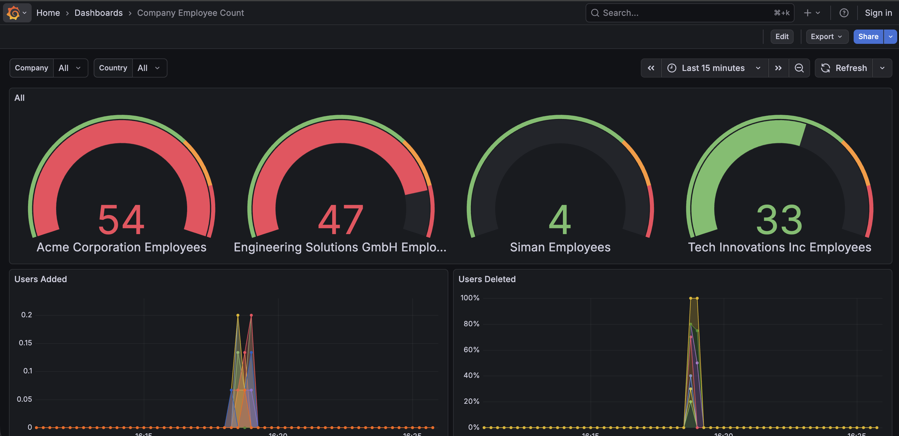

# Adding OpenTelemetry Observability to Spring Boot

How to add **production-ready observability** to Spring Boot applications using the OpenTelemetry Java Agent, Micrometer with Prometheus, and the Grafana LGTM stack.

## Table of Contents
- [How to Setup the LGTM Stack](#how-to-setup-the-lgtm-stack)
- [How to Instrument Your Spring Boot Project](#how-to-instrument-your-spring-boot-project)
- [How to Implement Custom Metrics](#how-to-implement-custom-metrics)
- [Quick Start Example Guide](#quick-start-example-guide)
- [Verification & Testing](#verification--testing)
- [Key Configuration Files Reference](#key-configuration-files-reference)
- [Troubleshooting](#troubleshooting)
- [Understanding the Observability Stack](#understanding-the-observability-stack)
- [Resources & Further Reading](#resources--further-reading)

## How to Setup the LGTM Stack

### 1. Copy Observability Configuration

Copy the `observability` directory to your project root. This folder contains the necessary configuration files for Grafana, Loki, Mimir, Tempo, and Alloy.

```bash
cp -r examples/java/observability .
```

### 2. Add Docker Compose Services

Copy the LGTM services configuration from `examples/java/docker-compose.yaml` to your project's `docker-compose.yaml`.

**Services to copy:**
- `mimir` (Metrics backend)
- `loki` (Logs backend)
- `tempo` (Traces backend)
- `alloy` (Telemetry collector)
- `grafana` (Visualization)

**Networks to copy:**
- `observability`

### 3. Configure Environment Variables

If you haven't already, create a `.env` file from the example provided:

```bash
cp examples/java/.env.example .env
```

**Important:** Modify the `.env` file to adapt it to your deployment infrastructure:
- Set `STORAGE_TYPE` (filesystem, s3, or gcs)
- Configure cloud credentials (`AWS_ACCESS_KEY_ID`, etc.) if using object storage
- Adjust ports if necessary to avoid conflicts

## How to Instrument Your Spring Boot Project

### Checklist: Implementing in Existing Apps

#### 1. Add Dependencies

Add the Spring Boot Actuator and Micrometer Prometheus Registry dependencies to your project.

**Maven** (`pom.xml`):
```xml
<dependency>
    <groupId>org.springframework.boot</groupId>
    <artifactId>spring-boot-starter-actuator</artifactId>
</dependency>
<dependency>
    <groupId>io.micrometer</groupId>
    <artifactId>micrometer-registry-prometheus</artifactId>
</dependency>
```

**Gradle** (`build.gradle`):
```groovy
implementation 'org.springframework.boot:spring-boot-starter-actuator'
implementation 'io.micrometer:micrometer-registry-prometheus'
```

#### 2. Update application.properties

Add these lines:
```properties
management.endpoints.web.exposure.include=health,info,prometheus,metrics
management.endpoint.health.show-details=always
```

#### 3. Configure Logging

Configure your logging framework to include trace correlation IDs (`trace_id` and `span_id`) in your log patterns. This enables linking logs to traces in Grafana.

For **Logback** (default in Spring Boot), create or update `logback-spring.xml`:
```xml
<pattern>%d{yyyy-MM-dd HH:mm:ss.SSS} [%thread] %-5level %logger{36} [traceid=%X{trace_id:-}, spanid=%X{span_id:-}] - %msg%n</pattern>
```

#### 4. Update Dockerfile

Add OTel agent download and attachment:
```dockerfile
# Download agent stage
FROM eclipse-temurin:17-jre AS agent
RUN apt-get update && apt-get install -y wget && \
    wget -O /otel-javaagent.jar \
    https://github.com/open-telemetry/opentelemetry-java-instrumentation/releases/latest/download/opentelemetry-javaagent.jar

# Runtime stage
FROM eclipse-temurin:17-jre
COPY --from=agent /otel-javaagent.jar otel-javaagent.jar
COPY target/*.jar app.jar
ENTRYPOINT ["sh", "-c", "java $JAVA_OPTS -javaagent:otel-javaagent.jar -jar app.jar"]
```

#### 5. Add Environment Variables

In your docker-compose.yaml or Kubernetes deployment:
```yaml
environment:
  # OpenTelemetry Agent Configuration
  OTEL_SERVICE_NAME: ${OTEL_SERVICE_NAME:-your-service-name}
  OTEL_SERVICE_VERSION: ${OTEL_SERVICE_VERSION:-0.0.1}
  OTEL_DEPLOYMENT_ENVIRONMENT: ${OTEL_DEPLOYMENT_ENVIRONMENT:-development}
  OTEL_EXPORTER_OTLP_ENDPOINT: ${OTEL_EXPORTER_OTLP_ENDPOINT:-http://alloy:4318}
  OTEL_RESOURCE_ATTRIBUTES: service.name=${OTEL_SERVICE_NAME:-your-service-name},service.version=${OTEL_SERVICE_VERSION:-0.0.1},deployment.environment=${OTEL_DEPLOYMENT_ENVIRONMENT:-development}
  # MDC Instrumentation for trace correlation in logs
  OTEL_INSTRUMENTATION_COMMON_MDC_ENABLED: ${OTEL_INSTRUMENTATION_COMMON_MDC_ENABLED:-true}
  OTEL_INSTRUMENTATION_LOGBACK_MDC_ADD_BAGGAGE: ${OTEL_INSTRUMENTATION_LOGBACK_MDC_ADD_BAGGAGE:-true}
```

#### 6. Set Up Grafana Alloy

Copy `observability/alloy.alloy` from this project and modify:
- Update service name in scrape targets
- Update endpoints to match your infrastructure
- Adjust scrape intervals if needed

```
// Scrape job for Spring Boot application metrics
prometheus.scrape "spring_app" {
  targets = [
    {
      "__address__" = "app:8081",
      "job"         = "userdemo-agent-micrometer",
      "environment" = "dev",
      "service"     = "userdemo-agent-micrometer",
    },
  ]

  forward_to      = [prometheus.remote_write.mimir.receiver]
  scrape_interval = "15s"
  scrape_timeout  = "10s"
  metrics_path    = "/actuator/prometheus"
}
```

#### 7. Deploy LGTM Stack

Deploy Tempo, Mimir, Loki, and Grafana:
- Use docker-compose.yaml as reference
- Or deploy to Kubernetes with Helm charts

### Production Considerations

**Security:**
- ✅ Enable authentication for Grafana (remove anonymous access)
- ✅ Use TLS for OTLP endpoints
- ✅ Add authentication to Alloy → backends (basic auth or API keys)
- ✅ Secure Prometheus endpoint (require authentication)

**Performance:**
- ✅ Adjust Alloy batch sizes based on traffic volume
- ✅ Configure retention policies for Tempo, Mimir, Loki
- ✅ Set resource limits on all containers
- ✅ Use sampling for high-traffic applications (reduce trace volume)

**Scalability:**
- ✅ Run multiple Alloy instances with load balancing
- ✅ Deploy LGTM backends in distributed mode (not monolithic)
- ✅ Use object storage (S3, GCS) for long-term trace/metric storage
- ✅ Implement alerting rules in Mimir

**Monitoring the Monitoring:**
- ✅ Monitor Alloy health and throughput
- ✅ Set up alerts for telemetry pipeline failures
- ✅ Track metrics ingestion rates and storage usage

[Back to Table of Contents](#table-of-contents)

---

## How to Implement Custom Metrics

### Why Custom Metrics?

While the default metrics from Micrometer and the OpenTelemetry agent provide excellent infrastructure and HTTP request metrics, **custom metrics let you track business-specific events and application domain logic**.

**Default metrics tell you:**
- JVM memory usage
- HTTP request rates and latencies
- Database connection pool utilization
- Thread counts and garbage collection

**Custom metrics tell you:**
- Users created in the last hour
- Orders processed by region
- Payment transactions by method
- Current inventory levels
- Active sessions by company

**When to add custom metrics:**
- ✅ Track business KPIs (conversion rates, revenue, user growth)
- ✅ Monitor domain-specific workflows (checkout completion, signup funnel)
- ✅ Measure application-specific events (cache hits, batch job processing)
- ✅ Create business dashboards for non-technical stakeholders
- ✅ Set up alerts on business thresholds (low inventory, high error rates)

### Trade-offs and Considerations

Unlike default metrics that work automatically, custom metrics require code changes and ongoing maintenance.

| Aspect | Default Metrics | Custom Metrics |
|--------|----------------|----------------|
| **Code Required** | None (automatic) | Yes (explicit instrumentation) |
| **Maintenance** | Maintained by framework | You maintain the code |
| **Scope** | Infrastructure & HTTP | Business logic & domain events |
| **Setup Time** | Immediate | Requires development |
| **Cardinality Risk** | Low (predefined tags) | High (if misused with unique IDs) |
| **Business Value** | System health | Business insights |

**Key risks to avoid:**

⚠️ **High cardinality tags**: Never use user IDs, session IDs, or timestamps as tags
```java
// BAD - Creates millions of unique metric combinations
Counter.builder("orders.total")
       .tag("user.id", userId)        // ❌ Unique per user
       .tag("timestamp", timestamp)   // ❌ Unique per second
       .register(meterRegistry);

// GOOD - Uses categorical tags
Counter.builder("orders.total")
       .tag("region", "us-east")      // ✅ Limited values
       .tag("payment.method", "card") // ✅ Limited values
       .register(meterRegistry);
```

⚠️ **Metric explosion**: Too many unique metrics can overwhelm your monitoring system

⚠️ **Performance overhead**: Metrics collection is fast, but millions of metrics per second can impact performance

✅ **Benefits when done right**: Business dashboards, better alerting, domain-specific insights

### Counter vs Gauge: Choosing the Right Metric Type

Micrometer provides several metric types, but **Counter** and **Gauge** are the most commonly used for custom metrics.

#### Counter: Tracking Events Over Time

**Counters** are monotonically increasing values that only go up (never decrease). Use counters to track events that accumulate.

**Characteristics:**
- Always increases
- Resets to 0 on application restart
- Prometheus convention: metric name ends with `_total`
- Query with `rate()` or `increase()` to see growth over time

**When to use:**
- ✅ User registrations
- ✅ API requests processed
- ✅ Orders completed
- ✅ Emails sent
- ✅ Errors encountered

**Example from this project** (`UserMetricsService.java`):

```java
private void incrementCreateCounter(String companyName, String countryName) {
    Counter.builder("users.created.total")
           .tag("company.name", companyName)
           .tag("country.name", countryName)
           .description("Total number of users created")
           .register(meterRegistry)
           .increment();
}
```

**What you get:**
- Metric name: `users_created_total`
- Tags: `company_name`, `country_name`
- Value increases by 1 each time a user is created

**Query in Grafana:**
```promql
# Users created per second in the last 5 minutes
rate(users_created_total{company_name="Acme Corporation"}[5m])

# Total users created in last hour
increase(users_created_total[1h])
```

#### Gauge: Tracking Current State

**Gauges** represent point-in-time measurements that can go up or down. Use gauges to track current values.

**Characteristics:**
- Can increase or decrease
- Represents "right now" value
- No `_total` suffix
- Query directly to see current value

**When to use:**
- ✅ Current user count
- ✅ Active sessions
- ✅ Queue size
- ✅ Inventory levels
- ✅ Temperature/sensor readings

**Example from this project** (`UserMetricsService.java`):

```java
private void registerCompanyGauge(String companyName, String countryName, AtomicInteger counter) {
    String gaugeKey = "company:" + companyName;

    // Prevent duplicate registration
    if (registeredGauges.add(gaugeKey)) {
        Gauge.builder("users.count.by.company", counter, AtomicInteger::get)
             .tag("company.name", companyName)
             .tag("country.name", countryName)
             .description("Number of users in company")
             .register(meterRegistry);

        LOGGER.info("Registered gauge for company='{}', country='{}'", companyName, countryName);
    }
}
```

**Key pattern for gauges:**
- Use `AtomicInteger` (or `AtomicDouble`) for thread-safe updates
- Register gauge once, update the underlying value
- Gauge reads from the `AtomicInteger` automatically

**Query in Grafana:**
```promql
# Current user count by company
users_count_by_company{company_name="Acme Corporation"}

# Total users across all companies
sum(users_count_by_company)
```

#### Quick Decision Guide

| Scenario | Metric Type | Example |
|----------|-------------|---------|
| Track events happening | Counter | `orders.completed.total` |
| Track current state | Gauge | `active.sessions.count` |
| Something always increases | Counter | `api.requests.total` |
| Something goes up and down | Gauge | `queue.size` |
| Need rate/velocity | Counter | `users.created.total` → `rate()` |
| Need current value | Gauge | `inventory.level` |

### Metric Naming Conventions

Micrometer uses **dot notation** for metric names, which automatically converts to Prometheus format (underscores).

**Pattern:** `<domain>.<entity>.<measurement>[.unit]`

**Examples from this project:**

| Micrometer Name | Prometheus Name | Description |
|----------------|-----------------|-------------|
| `users.created.total` | `users_created_total` | Counter of users created |
| `users.deleted.total` | `users_deleted_total` | Counter of users deleted |
| `users.count.by.company` | `users_count_by_company` | Gauge of current users per company |
| `users.count.by.country` | `users_count_by_country` | Gauge of current users per country |

**Naming best practices:**

✅ **Use lowercase with dots**: `users.created.total`
✅ **Be descriptive but concise**: `orders.completed.total` not `o.c.t`
✅ **End counters with `.total`**: Follows Prometheus convention
✅ **Include unit when ambiguous**: `response.time.seconds` not just `response.time`
✅ **Use consistent domain prefixes**: All user metrics start with `users.`

❌ **Avoid:**
- CamelCase: `usersCreatedTotal`
- Mixed separators: `users_created.total`
- Abbreviations: `usr.crt.tot`
- Inconsistent naming: `user.created.total` and `users.deleted.count`

### Using Tags for Multi-Dimensional Metrics

Tags (also called labels) add dimensions to your metrics, enabling filtering and aggregation.

**Tag key naming convention:** Use lowercase dot notation (same as metric names)

Micrometer recommends following the same lowercase dot notation for tag keys as you use for metric names. This ensures maximum portability across different monitoring systems, as Micrometer automatically converts the naming convention to match each backend's requirements.

**Example from this project:**

```java
Counter.builder("users.created.total")
       .tag("company.name", companyName)    // Dimension 1
       .tag("country.name", countryName)    // Dimension 2
       .description("Total number of users created")
       .register(meterRegistry)
       .increment();
```

**This creates metrics like:**
```
users_created_total{company_name="Acme Corporation", country_name="United States"} 42
users_created_total{company_name="Tech Innovations Inc", country_name="Canada"} 18
users_created_total{company_name="Siman", country_name="Argentina"} 3
```

**Note:** When exported to Prometheus, Micrometer automatically converts the dot notation tag keys (`company.name`) to snake_case (`company_name`) to match Prometheus conventions.

**Querying with tags in Grafana:**

```promql
# Filter by specific company
users_created_total{company_name="Acme Corporation"}

# Filter by country
users_created_total{country_name="United States"}

# Aggregate across all companies in a country
sum by (country_name) (users_created_total)

# Group by company
sum by (company_name) (users_created_total)
```

**Good tag examples:**

✅ **Low cardinality** (limited, categorical values):
- `environment`: dev, staging, prod
- `region`: us-east, us-west, eu-central
- `version`: 1.0.0, 1.1.0
- `payment.method`: card, paypal, bank_transfer
- `order.status`: pending, completed, failed

❌ **Bad tag examples** (high cardinality):
- `user.id`: unique per user (millions of values)
- `session.id`: unique per session
- `timestamp`: unique per second
- `request.id`: unique per request
- `email`: unique per user

**Why cardinality matters:**

Each unique combination of tags creates a new time series in Prometheus/Mimir. High cardinality can create millions of time series, causing:
- Slow queries
- High memory usage
- Storage explosion
- Query timeouts

**Rule of thumb:** Keep total unique tag combinations under 10,000 per metric.

### Step-by-Step Implementation

This project demonstrates a production-ready pattern for custom metrics. Let's walk through the implementation.

#### Step 1: Configuration Class

Create a configuration class to set up your metrics service with `MeterRegistry` injection.

**File:** `src/main/java/co/ravn/userdemo/config/MetricsConfiguration.java`

```java
package co.ravn.userdemo.config;

import co.ravn.userdemo.model.User;
import co.ravn.userdemo.repository.UserRepository;
import co.ravn.userdemo.service.CompanyService;
import co.ravn.userdemo.service.CountryService;
import co.ravn.userdemo.service.UserMetricsService;
import io.micrometer.core.instrument.MeterRegistry;
import org.springframework.boot.CommandLineRunner;
import org.springframework.context.annotation.Bean;
import org.springframework.context.annotation.Configuration;

import java.util.List;

@Configuration
public class MetricsConfiguration {

    /**
     * Define UserMetricsService bean.
     * Spring will auto-inject MeterRegistry dependency.
     */
    @Bean
    public UserMetricsService userMetricsService(
            MeterRegistry meterRegistry,
            CompanyService companyService,
            CountryService countryService) {
        return new UserMetricsService(meterRegistry, companyService, countryService);
    }

    /**
     * Initialize metrics on application startup.
     * Loads existing users from database and registers gauges.
     */
    @Bean
    public CommandLineRunner initializeUserMetrics(
            UserMetricsService userMetricsService,
            UserRepository userRepository) {
        return args -> {
            List<User> existingUsers = userRepository.findAll();
            userMetricsService.initializeMetrics(existingUsers);
        };
    }
}
```

**Key points:**
- `MeterRegistry` is auto-configured by Spring Boot Actuator
- `@Bean` methods create managed Spring components
- `CommandLineRunner` runs after application startup
- Initializes gauges with existing data from database

#### Step 2: Create a Metrics Service

Create a dedicated service to encapsulate all metrics logic.

**File:** `src/main/java/co/ravn/userdemo/service/UserMetricsService.java` (simplified example)

```java
package co.ravn.userdemo.service;

import io.micrometer.core.instrument.Counter;
import io.micrometer.core.instrument.Gauge;
import io.micrometer.core.instrument.MeterRegistry;
import org.springframework.stereotype.Service;

import java.util.Set;
import java.util.concurrent.ConcurrentHashMap;
import java.util.concurrent.atomic.AtomicInteger;

@Service
public class UserMetricsService {

    private final MeterRegistry meterRegistry;
    private final CompanyService companyService;
    private final CountryService countryService;

    // Track current user counts for gauges
    private final ConcurrentHashMap<String, AtomicInteger> companyUserCounts = new ConcurrentHashMap<>();
    private final ConcurrentHashMap<String, AtomicInteger> countryUserCounts = new ConcurrentHashMap<>();

    // Prevent duplicate gauge registration
    private final Set<String> registeredGauges = ConcurrentHashMap.newKeySet();

    public UserMetricsService(MeterRegistry meterRegistry,
                              CompanyService companyService,
                              CountryService countryService) {
        this.meterRegistry = meterRegistry;
        this.companyService = companyService;
        this.countryService = countryService;
    }

    /**
     * Called when a user is created.
     */
    public void recordUserCreated(Long countryId, Long companyId) {
        String companyName = companyService.getCompanyName(companyId);
        String countryName = countryService.getCountryName(countryId);

        // Increment counters
        incrementCreateCounter(companyName, countryName);

        // Update gauges
        incrementGaugeCounter(countryId, companyId);
    }

    // ... more methods below
}
```

**Key patterns:**
- ✅ **Thread-safe collections**: `ConcurrentHashMap`, `AtomicInteger`
- ✅ **Duplicate prevention**: `registeredGauges` Set tracks registered gauges
- ✅ **Separation of concerns**: Metrics logic isolated from business logic
- ✅ **Dependency injection**: `MeterRegistry` injected by Spring

#### Step 3: Implementing Counters

Add methods to increment counters when events occur.

```java
private void incrementCreateCounter(String companyName, String countryName) {
    Counter.builder("users.created.total")
           .tag("company.name", companyName)
           .tag("country.name", countryName)
           .description("Total number of users created")
           .register(meterRegistry)
           .increment();
}

private void incrementDeleteCounter(String companyName, String countryName) {
    Counter.builder("users.deleted.total")
           .tag("company.name", companyName)
           .tag("country.name", countryName)
           .description("Total number of users deleted")
           .register(meterRegistry)
           .increment();
}

private void incrementUpdateCounter(String companyName, String countryName) {
    Counter.builder("users.updated.total")
           .tag("company.name", companyName)
           .tag("country.name", countryName)
           .description("Total number of users updated")
           .register(meterRegistry)
           .increment();
}
```

**Pattern explained:**
1. `Counter.builder(name)` - Start building a counter
2. `.tag(key, value)` - Add dimensional tags
3. `.description(text)` - Add human-readable description
4. `.register(meterRegistry)` - Register with Micrometer
5. `.increment()` - Increase counter by 1

**Note:** Calling `register()` multiple times with the same name and tags returns the same counter instance, so it's safe to call inline.

#### Step 4: Implementing Gauges

Gauges require more care because they read from a reference value.

```java
private void incrementGaugeCounter(Long countryId, Long companyId) {
    String companyName = companyService.getCompanyName(companyId);
    String countryName = countryService.getCountryName(countryId);

    // Get or create counter for company
    AtomicInteger companyCounter = companyUserCounts.computeIfAbsent(companyName, k -> {
        AtomicInteger counter = new AtomicInteger(0);
        registerCompanyGauge(companyName, countryName, counter);
        return counter;
    });
    companyCounter.incrementAndGet();

    // Get or create counter for country
    AtomicInteger countryCounter = countryUserCounts.computeIfAbsent(countryName, k -> {
        AtomicInteger counter = new AtomicInteger(0);
        registerCountryGauge(countryName, counter);
        return counter;
    });
    countryCounter.incrementAndGet();
}

private void registerCompanyGauge(String companyName, String countryName, AtomicInteger counter) {
    String gaugeKey = "company:" + companyName;

    // Only register once per company
    if (registeredGauges.add(gaugeKey)) {
        Gauge.builder("users.count.by.company", counter, AtomicInteger::get)
             .tag("company.name", companyName)
             .tag("country.name", countryName)
             .description("Number of users in company")
             .register(meterRegistry);
    }
}

private void registerCountryGauge(String countryName, AtomicInteger counter) {
    String gaugeKey = "country:" + countryName;

    // Only register once per country
    if (registeredGauges.add(gaugeKey)) {
        Gauge.builder("users.count.by.country", counter, AtomicInteger::get)
             .tag("country.name", countryName)
             .description("Number of users in country")
             .register(meterRegistry);
    }
}
```

**Gauge pattern explained:**
1. Create `AtomicInteger` to hold the current value
2. Store it in a map for later updates
3. Register gauge with `AtomicInteger::get` method reference
4. Update the `AtomicInteger` value (gauge reads it automatically)
5. Prevent duplicate registration with `registeredGauges` Set

**Why `AtomicInteger`?**
- Thread-safe increment/decrement operations
- Gauge reads current value via method reference
- No need to re-register gauge when value changes

#### Step 5: Initialize Metrics on Startup (Optional)

For gauges representing current state, initialize with existing data.

```java
public void initializeMetrics(List<User> existingUsers) {
    LOGGER.info("Initializing user metrics for {} existing users", existingUsers.size());

    for (User user : existingUsers) {
        incrementGaugeCounter(user.countryId(), user.companyId());
    }

    LOGGER.debug("User metrics initialized: {} companies tracked, {} countries tracked",
        companyUserCounts.size(), countryUserCounts.size());
}
```

**Why initialize?**
- Gauges show current state, not historical events
- On restart, gauge values would be 0 without initialization
- Load existing data from database to restore accurate counts
- Called via `CommandLineRunner` after Spring Boot startup

**Warning**
- Monitor startup time impact
- If your data set is large, consider performance impact during startup
- May need batching or async initialization for very large datasets
- Handle exceptions gracefully to avoid startup failures

#### Step 6: Integrate with Business Logic

Call your metrics service from your business logic layer.

**File:** `src/main/java/co/ravn/userdemo/service/UserService.java`

```java
@Service
public class UserService {

    private final UserRepository userRepository;
    private final UserMetricsService userMetricsService;
    private final CountryService countryService;
    private final CompanyService companyService;

    public UserService(UserRepository userRepository,
                       UserMetricsService userMetricsService,
                       CountryService countryService,
                       CompanyService companyService) {
        this.userRepository = userRepository;
        this.userMetricsService = userMetricsService;
        this.countryService = countryService;
        this.companyService = companyService;
    }

    /**
     * Create a new user and record metrics.
     */
    public User create(String name, Long countryId, Long companyId) {
        // Validation
        this.countryService.findWithId(countryId);
        this.companyService.findWithId(companyId);

        // Save to database
        User user = this.userRepository.save(new User(null, name, countryId, companyId));

        // Record metric AFTER successful operation
        this.userMetricsService.recordUserCreated(countryId, companyId);

        return user;
    }

    /**
     * Update a user and record metrics.
     */
    public User update(Long id, String name, Long countryId, Long companyId) {
        User existing = findWithId(id);

        // Validation
        this.countryService.findWithId(countryId);
        this.companyService.findWithId(companyId);

        // Update database
        User updated = this.userRepository.save(new User(id, name, countryId, companyId));

        // Record metric with old and new locations
        this.userMetricsService.recordUserUpdated(
            existing.countryId(), existing.companyId(),
            countryId, companyId
        );

        return updated;
    }

    /**
     * Delete a user and record metrics.
     */
    public void delete(long id) {
        User existing = findWithId(id);

        // Delete from database
        this.userRepository.deleteById(id);

        // Record metric
        this.userMetricsService.recordUserDeleted(existing.countryId(), existing.companyId());
    }
}
```

**Integration best practices:**
- ✅ Record metrics **after** successful database operations
- ✅ Pass necessary context (IDs, categories) to metrics service
- ✅ Keep metrics code separate from business logic
- ✅ Don't let metrics failures break business operations
- ✅ Use existing transaction boundaries (metrics inside transaction)

### Best Practices Summary

**Design:**
- ✅ Create a dedicated metrics service (e.g., `UserMetricsService`)
- ✅ Use dependency injection for `MeterRegistry`
- ✅ Keep metrics logic separate from business logic
- ✅ Initialize gauges at startup with existing data

**Thread Safety:**
- ✅ Use `ConcurrentHashMap` for storing metric references
- ✅ Use `AtomicInteger` or `AtomicDouble` for gauge values
- ✅ Micrometer's `MeterRegistry` is thread-safe

**Registration:**
- ✅ Counters: Safe to register inline (idempotent)
- ✅ Gauges: Prevent duplicates with a tracking Set
- ✅ Always add `.description()` for documentation

**Naming & Tags:**
- ✅ Use dot notation for both metrics and tags: `users.created.total`
- ✅ End counters with `.total`
- ✅ Use dot notation for tag keys: `company.name`, `country.name`
- ✅ Keep tag cardinality low (< 10,000 combinations)

**Integration:**
- ✅ Record metrics after successful operations
- ✅ Don't throw exceptions from metrics code
- ✅ Consider metrics as "observability side effects"

### Verifying Your Custom Metrics

Once implemented, verify your custom metrics are working:

#### 1. Check Prometheus Endpoint

```bash
# View all metrics
curl http://localhost:8081/actuator/prometheus

# Filter for your custom metrics
curl http://localhost:8081/actuator/prometheus | grep users_created

# Expected output:
# HELP users_created_total Total number of users created
# TYPE users_created_total counter
users_created_total{company_name="Acme Corporation",country_name="United States",} 42.0
users_created_total{company_name="Tech Innovations Inc",country_name="Canada",} 18.0
```

#### 2. Query in Grafana

1. Open Grafana: http://localhost:3030
2. Go to **Explore** (compass icon)
3. Select **Mimir** datasource
4. Try these queries:

```promql
# View current user count by company
users_count_by_company

# Users created per second (5 minute average)
rate(users_created_total[5m])

# Total users created in last hour
increase(users_created_total[1h])

# Filter by company
users_created_total{company_name="Acme Corporation"}

# Sum across all companies
sum(users_count_by_company)

# Group by country
sum by (country_name) (users_count_by_company)
```

#### 3. Test Live Updates

```bash
# Create a user
curl -X POST http://localhost:8081/api/users \
  -H "Content-Type: application/json" \
  -d '{"name":"Test User","countryId":1,"companyId":1}'

# Check metrics immediately
curl http://localhost:8081/actuator/prometheus | grep users_created_total

# The counter should have incremented
```

### Dashboard Example

This project includes a complete dashboard example showing custom metrics in action.



**Dashboard components:**

**Top Row - Gauges (Current State):**
- **Acme Corporation Employees**: 54 users (gauge visualization)
- **Engineering Solutions GmbH Employees**: 47 users
- **Siman Employees**: 4 users
- **Tech Innovations Inc Employees**: 33 users

Each gauge shows the current user count using `users_count_by_company` metric with color coding (red = high, green = low).

**Bottom Row - Time Series (Events Over Time):**
- **Users Added**: Timeline showing `rate(users_created_total[5m])` by company
- **Users Deleted**: Timeline showing `rate(users_deleted_total[5m])` by company

**PromQL queries used:**

```promql
# Gauge panels
users_count_by_company{company_name="Acme Corporation"}

# Time series panels
rate(users_created_total[5m])
rate(users_deleted_total[5m])

# Aggregated view
sum by (company_name) (users_count_by_company)
```

**Dashboard features:**
- **Multi-dimensional filtering**: Filter by company or country using tags
- **Real-time updates**: Metrics update every 15 seconds (scrape interval)
- **Business insights**: Non-technical stakeholders can understand user growth
- **Alerting ready**: Set thresholds on user counts or creation rates

**Creating your own dashboard:**
1. In Grafana, click **Create → Dashboard**
2. Add a panel
3. Select **Mimir** datasource
4. Enter a PromQL query (e.g., `users_count_by_company`)
5. Choose visualization type (Gauge, Time series, Bar chart)
6. Add filters using tag selectors: `{company_name="Acme Corporation"}`

[Back to Table of Contents](#table-of-contents)

---

## Quick Start Example Guide

### 1. Prerequisites

Ensure you have:
- ✅ Docker and Docker Compose installed
- ✅ Java 17+ (if building locally)
- ✅ Maven 3.9+ (if building locally)

### 2. Clone and Start

```bash
# Navigate to project directory
cd /examples/java

# Optional: Create environment file
cp .env.example .env

# Start the entire stack
docker-compose up --build
```

**Initial startup takes 2-3 minutes** as Docker builds images and starts all services.

### 3. Access Points

Once running, access these URLs:

| Service | URL | Purpose |
|---------|-----|---------|
| **Application** | http://localhost:8081/api | REST API |
| **Grafana** | http://localhost:3030 | Dashboards (admin/admin) |
| **Alloy UI** | http://localhost:12345 | Telemetry pipeline status |
| **Health Check** | http://localhost:8081/actuator/health | App health |
| **Prometheus Metrics** | http://localhost:8081/actuator/prometheus | Metrics endpoint |

Application Endpoints:

| Method | Endpoint | Description |
|--------|----------|-------------|
| GET    | `/api`   | List all users |
| GET    | `/api/{id}` | Get specific user |
| POST   | `/api/users` | Create a new user |
| DELETE | `/api/{id}` | Delete a user |
| GET    | `/actuator/health` | Application health check |
| GET    | `/actuator/prometheus` | Prometheus metrics endpoint |
| GET    | `/actuator/metrics` | Spring Boot metrics |


### 4. Sample API Requests

```bash
# List all users
curl http://localhost:8081/api

# Get specific user
curl http://localhost:8081/api/1

# Health check
curl http://localhost:8081/actuator/health

# View Prometheus metrics
curl http://localhost:8081/actuator/prometheus
```

### 5. Stop and Clean Up

```bash
# Stop services
docker-compose down

# Stop and remove volumes (deletes stored data)
docker-compose down -v
```

[Back to Table of Contents](#table-of-contents)

---

## Verification & Testing

### 1. Verify Traces in Tempo

1. Open Grafana: http://localhost:3030
2. Go to **Explore** (compass icon in sidebar)
3. Select **Tempo** datasource
4. Click **Search** tab
5. Filter by `service.name = userdemo-agent-micrometer`
6. Click **Run Query**

**You should see:**
- Traces for GET requests to `/api` and `/api/{id}`
- Spans showing controller → service → database flow
- Timing information for each span

**Example trace structure:**
```
GET /api/users
  ├─ UserController.all()         [2ms]
  │   └─ UserService.listAll()    [98ms]
  │       ├─ Transaction          [1ms]
  │       ├─ JDBC SELECT          [95ms]
  │       └─ Commit               [2ms]
```

### 2. Verify Metrics in Mimir

1. In Grafana Explore, select **Mimir** datasource
2. Switch to **Code** mode (bottom right)
3. Try these queries:

```promql
# JVM memory usage
jvm_memory_used_bytes{job="userdemo-agent-micrometer"}

# HTTP request rate
rate(http_server_requests_seconds_count{job="userdemo-agent-micrometer"}[1m])

# Database connections
hikaricp_connections_active{job="userdemo-agent-micrometer"}
```

**You should see:**
- Metrics data with values
- Labels like `job`, `environment`, `service`
- Time series graphs

### 3. Verify Logs in Loki

1. In Grafana Explore, select **Loki** datasource
2. Use this query:

```logql
{service_name="userdemo-agent-micrometer"}
```

**You should see:**
- Log entries with timestamps
- Trace IDs in format: `[traceid=abc123, spanid=def456]`
- Log levels (INFO, DEBUG, etc.)

### 4. Test Trace-to-Log Correlation

1. In Tempo, open any trace
2. Click on a span
3. Look for **"Logs for this span"** button
4. Click it → Grafana switches to Loki with filtered logs
5. You should see only logs from that specific trace

**Or go the other direction:**
1. In Loki, find a log entry with a trace_id
2. Click on the Tempo button
3. Grafana switches to Tempo showing the full trace

### 5. Verify Prometheus Endpoint

```bash
# Check the Prometheus metrics endpoint is working
curl http://localhost:8081/actuator/prometheus | grep jvm_memory_used_bytes

# Expected output:
# jvm_memory_used_bytes{area="heap",id="G1 Eden Space",} 5.2428800E7
# jvm_memory_used_bytes{area="heap",id="G1 Old Gen",} 1.2345678E7
```

### 6. Verify Alloy is Scraping

1. Open Alloy UI: http://localhost:12345
2. Look for **"prometheus.scrape.spring_app"** component
3. Check status shows "healthy" or "up"
4. View targets list to confirm scraping is active

**Or check Alloy logs:**
```bash
docker-compose logs alloy | grep "spring_app"

# Look for:
# level=info component=prometheus.scrape.spring_app msg="Scrape successful"
```

[Back to Table of Contents](#table-of-contents)

---

## Key Configuration Files Reference

### 1. Dockerfile
**Location**: `/Dockerfile`
**Purpose**: Multi-stage build that downloads OTel agent and attaches it to JVM
**Key line**: `ENTRYPOINT ["sh", "-c", "java $JAVA_OPTS -javaagent:otel-javaagent.jar -jar app.jar"]`

### 2. docker-compose.yaml
**Location**: `/docker-compose.yaml`
**Purpose**: Defines entire observability stack

### 3. alloy.alloy
**Location**: `/observability/alloy.alloy`
**Purpose**: Alloy telemetry pipeline configuration

### 4. grafana-datasources.yaml
**Location**: `/observability/grafana-datasources.yaml`
**Purpose**: Auto-provision Grafana datasources with correlation

### 5. application.properties
**Location**: `/src/main/resources/application.properties`
**Purpose**: Spring Boot configuration

### 6. logback-spring.xml
**Location**: `/src/main/resources/logback-spring.xml`
**Purpose**: Logging configuration with trace correlation
**Key pattern**: `[traceid=%X{trace_id:-}, spanid=%X{span_id:-}]`

### 7. pom.xml
**Location**: `/pom.xml`
**Purpose**: Maven dependencies
**Key dependencies**:
- Spring Boot Actuator
- Micrometer Prometheus registry

[Back to Table of Contents](#table-of-contents)

---

## Troubleshooting

### Logs Don't Show trace_id

**Symptom**: Log entries show `[traceid=, spanid=]` (empty values)

**Solution**:
1. Verify environment variables are set:
```bash
docker-compose exec app env | grep OTEL_INSTRUMENTATION

# Should show:
# OTEL_INSTRUMENTATION_COMMON_MDC_ENABLED=true
# OTEL_INSTRUMENTATION_LOGBACK_MDC_ADD_BAGGAGE=true
```

2. Check logback-spring.xml pattern includes MDC variables:
```xml
[traceid=%X{trace_id:-}, spanid=%X{span_id:-}]
```

3. Restart application:
```bash
docker-compose restart app
```

### OTel Agent Not Starting

**Symptom**: No traces in Tempo, logs don't mention OpenTelemetry

**Solution**:
1. Check app logs for agent startup:
```bash
docker-compose logs app | grep -i opentelemetry

# Should see:
# [otel.javaagent] OpenTelemetry Javaagent started
```

2. Verify agent JAR exists in container:
```bash
docker-compose exec app ls -l otel-javaagent.jar
```

3. Check ENTRYPOINT includes `-javaagent`:
```bash
docker-compose exec app ps aux | grep javaagent
```

### Prometheus Endpoint Returns 404

**Symptom**: `curl http://localhost:8081/actuator/prometheus` returns 404

**Solution**:
1. Verify Micrometer dependency in pom.xml:
```xml
<dependency>
    <groupId>io.micrometer</groupId>
    <artifactId>micrometer-registry-prometheus</artifactId>
</dependency>
```

2. Check application.properties enables endpoint:
```properties
management.endpoints.web.exposure.include=health,info,prometheus
```

3. Rebuild and restart:
```bash
docker-compose up --build
```

### Alloy Not Scraping Metrics

**Symptom**: Metrics not appearing in Mimir

**Solution**:
1. Check Alloy logs:
```bash
docker-compose logs alloy | grep spring_app

# Look for errors or "Scrape failed"
```

2. Verify Alloy can reach app:
```bash
docker-compose exec alloy wget -O- http://app:8081/actuator/prometheus
```

3. Check alloy-config.alloy has correct target:
```alloy
targets = [{
    "__address__" = "app:8081",  # Must match service name
    ...
}]
```

### Traces Not Appearing in Tempo

**Symptom**: No traces in Grafana/Tempo

**Solution**:
1. Verify OTLP endpoint is correct:
```bash
docker-compose exec app env | grep OTEL_EXPORTER_OTLP_ENDPOINT

# Should be: http://alloy:4318
```

2. Check Alloy is receiving traces:
```bash
docker-compose logs alloy | grep -i trace
```

3. Test OTLP endpoint is reachable:
```bash
docker-compose exec app curl -v http://alloy:4318
```

4. Generate some traces:
```bash
curl http://localhost:8081/api
curl http://localhost:8081/api/1
```

### Database Connection Failed

**Symptom**: App logs show "Connection refused" to PostgreSQL

**Solution**:
1. Check PostgreSQL is healthy:
```bash
docker-compose ps postgres

# Status should show "healthy"
```

2. View PostgreSQL logs:
```bash
docker-compose logs postgres
```

3. Verify connection settings match:
```bash
# In compose.yaml, app service:
DB_URL: jdbc:postgresql://postgres:5432/userdemo
DB_USERNAME: admin
DB_PASSWORD: secret
```

### Grafana Shows "No Data"

**Symptom**: Grafana datasources show "No data" or errors

**Solution**:
1. Check all backend services are running:
```bash
docker-compose ps

# All services should show "Up" or "healthy"
```

2. Test datasource connectivity in Grafana:
   - Go to Configuration → Data Sources
   - Click each datasource (Tempo, Mimir, Loki)
   - Click "Save & Test"
   - Should show green "Data source is working"

3. Verify datasource URLs in grafana-datasources.yaml:
```yaml
- name: Tempo
  url: http://tempo:3200
- name: Mimir
  url: http://mimir:9009/prometheus
- name: Loki
  url: http://loki:3100
```

[Back to Table of Contents](#table-of-contents)

---

## Understanding the Observability Stack

### What is Observability?

Observability means understanding your application's internal state by examining its external outputs. The three pillars are:

1. **Traces** - Show request flow through your system (e.g., HTTP request → controller → service → database)
2. **Metrics** - Numerical measurements over time (e.g., request rate, memory usage, error count)
3. **Logs** - Timestamped event records (e.g., "User 123 logged in", "Database query failed")

### The LGTM Stack

This project uses **Grafana's LGTM stack** (Loki, Grafana, Tempo, Mimir):

| Component | Purpose | Data Type |
|-----------|---------|-----------|
| **Tempo** | Distributed tracing backend | Traces |
| **Mimir** | Prometheus-compatible metrics storage | Metrics |
| **Loki** | Log aggregation system | Logs |
| **Grafana** | Unified visualization dashboard | All (queries the above) |

**Why LGTM?**
- **Integrated**: Built to work seamlessly together
- **Open source**: No vendor lock-in
- **Correlation**: Native support for linking traces ↔ logs ↔ metrics
- **Prometheus-compatible**: Works with existing Prometheus dashboards

### Architecture Overview

```
┌────────────────────────────────────────────────────────────┐
│                  Spring Boot Application                   │
│                                                            │
│  ┌──────────────────┐         ┌──────────────────┐         │
│  │  OTel Java Agent │         │   Micrometer     │         │
│  │  (automatic)     │         │   + Prometheus   │         │
│  │                  │         │   (endpoint)     │         │
│  │  • Traces        │         │  • JVM metrics   │         │
│  │  • Auto metrics  │         │  • Custom metrics│         │
│  │  • MDC injection │         │  • /actuator/    │         │
│  └────────┬─────────┘         └────────┬─────────┘         │
│           │                            │                   │
│           │ OTLP (push)                │ HTTP (pull)       │
└───────────┼────────────────────────────┼───────────────────┘
            │                            │
            ↓                            ↓
     ┌──────────────────────────────────────────┐
     │         Grafana Alloy                    │
     │  (Central Telemetry Collector & Router)  │
     │                                          │
     │  • Receives OTLP (traces/metrics/logs)   │
     │  • Scrapes Prometheus endpoints          │
     │  • Batches and routes telemetry          │
     └──────────┬───────────────────────────────┘
                │
                ├─→ Tempo (traces)
                ├─→ Mimir (metrics)
                └─→ Loki (logs)
                       ↓
                ┌─────────────┐
                │   Grafana   │
                │ (Dashboard) │
                └─────────────┘
```

### Traces Pipeline

```
┌─────────────────────────────────────┐
│    Spring Boot Application          │
│                                     │
│  OTel Java Agent instruments:       │
│  • HTTP requests (Spring MVC)       │
│  • Database queries (JDBC)          │
│  • Async operations (@Async)        │
│  • Transactions (@Transactional)    │
└──────────────┬──────────────────────┘
               │
               │ OTLP HTTP (port 4318)
               │ Protocol: protobuf
               ↓
      ┌────────────────┐
      │  Grafana Alloy │
      │                │
      │  otelcol.      │
      │  receiver.otlp │
      └────────┬───────┘
               │
               │ Batch processor
               │ (groups spans)
               ↓
      ┌────────────────┐
      │  otelcol.      │
      │  exporter.otlp │
      └────────┬───────┘
               │
               │ OTLP gRPC (port 4317)
               ↓
      ┌────────────────┐
      │ Grafana Tempo  │
      │ (Trace Storage)│
      └────────┬───────┘
               │
               │ TraceQL queries
               ↓
         ┌──────────┐
         │ Grafana  │
         │  (UI)    │
         └──────────┘
```

**Key points:**
- **Push model**: App actively sends traces to Alloy
- **OTLP format**: Industry-standard OpenTelemetry protocol
- **Batching**: Alloy groups spans before export (efficiency)
- **Storage**: Tempo stores traces in efficient binary format

### Metrics Pipeline (Dual Path)

#### Path 1: Micrometer (Prometheus Scraping)

```
┌─────────────────────────────────────┐
│    Spring Boot Application          │
│                                     │
│  Micrometer Prometheus Registry:    │
│  • JVM metrics                      │
│  • HTTP server metrics              │
│  • Database pool metrics            │
│  • Custom metrics (if added)        │
│                                     │
│  Exposed at:                        │
│  /actuator/prometheus               │
└──────────────┬──────────────────────┘
               │
               │ HTTP GET (every 15s)
               │ Format: Prometheus text
               ↓
      ┌────────────────┐
      │  Grafana Alloy │
      │                │
      │  prometheus.   │
      │  scrape        │
      └────────┬───────┘
               │
               │ Prometheus Remote Write
               │ Protocol: protobuf
               ↓
      ┌────────────────┐
      │ Grafana Mimir  │
      │ (Metrics       │
      │  Storage)      │
      └────────┬───────┘
               │
               │ PromQL queries
               ↓
         ┌──────────┐
         │ Grafana  │
         │  (UI)    │
         └──────────┘
```

**Why this path exists:**
- **Standard Prometheus workflow**: Dashboards expect Prometheus format
- **Pull model**: Alloy controls scrape rate, not the app
- **Compatibility**: Works with all Prometheus-based tools

#### Path 2: OTel Agent (Automatic Metrics)

```
┌─────────────────────────────────────┐
│    Spring Boot Application          │
│                                     │
│  OTel Java Agent auto-exports:      │
│  • JVM runtime metrics              │
│  • HTTP server metrics              │
│  • JDBC metrics                     │
└──────────────┬──────────────────────┘
               │
               │ OTLP HTTP (port 4318)
               ↓
      ┌────────────────┐
      │  Grafana Alloy │
      │                │
      │  otelcol.      │
      │  receiver.otlp │
      └────────┬───────┘
               │
               │ Convert to Prometheus format
               ↓
      ┌────────────────┐
      │  otelcol.      │
      │  exporter.     │
      │  prometheus    │
      └────────┬───────┘
               │
               │ Prometheus Remote Write
               ↓
      ┌────────────────┐
      │ Grafana Mimir  │
      └────────┬───────┘
               │
               ↓
         ┌──────────┐
         │ Grafana  │
         └──────────┘
```

**Why both paths?**
- **Path 1 (Micrometer)**: Standard Prometheus compatibility
- **Path 2 (OTel)**: Additional automatic infrastructure metrics
- **Combined**: Comprehensive metrics coverage with maximum compatibility

### Logs Pipeline

```
┌─────────────────────────────────────┐
│    Spring Boot Application          │
│                                     │
│  Logback:                           │
│  • Logs to stdout                   │
│  • Includes trace_id from MDC       │
│  • Includes span_id from MDC        │
│                                     │
│  Pattern:                           │
│  [traceid=%X{trace_id:-}]           │
└──────────────┬──────────────────────┘
               │
               │ stdout (Docker captures)
               │ Format: structured text
               ↓
      ┌────────────────┐
      │  Docker        │
      │  (captures     │
      │   stdout)      │
      └────────┬───────┘
               │
               │ OTLP HTTP (port 4318)
               ↓
      ┌────────────────┐
      │  Grafana Alloy │
      │                │
      │  otelcol.      │
      │  receiver.otlp │
      └────────┬───────┘
               │
               │ Parse and forward
               ↓
      ┌────────────────┐
      │  otelcol.      │
      │  exporter.loki │
      └────────┬───────┘
               │
               │ HTTP POST
               ↓
      ┌────────────────┐
      │ Grafana Loki   │
      │ (Log Storage)  │
      └────────┬───────┘
               │
               │ LogQL queries
               ↓
         ┌──────────┐
         │ Grafana  │
         │  (UI)    │
         └──────────┘
```

**Key points:**
- **Structured logs**: Consistent format makes parsing reliable
- **MDC injection**: OTel Agent adds trace_id/span_id automatically
- **Docker stdout**: Standard pattern for containerized apps
- **Loki storage**: Efficient log storage with label-based indexing

### Data Correlation in Grafana

**Trace → Logs:**
```
1. View trace in Tempo
2. Click "Logs for this span" button
3. Loki query: {service="userdemo-agent-micrometer"} |= "traceid=<trace_id>"
4. See all logs from that trace
```

**Logs → Trace:**
```
1. View logs in Loki
2. Click on Tempo in log entry
3. Grafana opens corresponding trace in Tempo
4. See full distributed trace
```

**Trace → Metrics:**
```
1. View trace in Tempo
2. Click "Metrics" tab
3. See span metrics (rate, duration, errors)
4. Query Mimir for related metrics
```

[Back to Table of Contents](#table-of-contents)

---

## Resources & Further Reading

### Official Documentation

- **OpenTelemetry Java Agent**: https://opentelemetry.io/docs/instrumentation/java/automatic/
- **Grafana Alloy**: https://grafana.com/docs/alloy/latest/
- **Grafana Tempo**: https://grafana.com/docs/tempo/latest/
- **Grafana Mimir**: https://grafana.com/docs/mimir/latest/
- **Grafana Loki**: https://grafana.com/docs/loki/latest/
- **Spring Boot Actuator**: https://docs.spring.io/spring-boot/docs/current/reference/html/actuator.html
- **Micrometer**: https://micrometer.io/docs

### Related Projects

- **OpenTelemetry Demo**: https://github.com/open-telemetry/opentelemetry-demo
- **Grafana LGTM Stack**: https://github.com/grafana/intro-to-mlt

### Key Concepts

- **OTLP Protocol**: https://opentelemetry.io/docs/specs/otlp/
- **Prometheus Remote Write**: https://prometheus.io/docs/concepts/remote_write_spec/
- **PromQL Query Language**: https://prometheus.io/docs/prometheus/latest/querying/basics/
- **LogQL Query Language**: https://grafana.com/docs/loki/latest/query/
- **TraceQL Query Language**: https://grafana.com/docs/tempo/latest/traceql/

[Back to Table of Contents](#table-of-contents)

---

## Built with

- Spring Boot 3.5.8
- Java 17
- OpenTelemetry Java Agent
- Micrometer with Prometheus
- Grafana LGTM Stack (Loki, Grafana, Tempo, Mimir)
- Grafana Alloy
- PostgreSQL 16